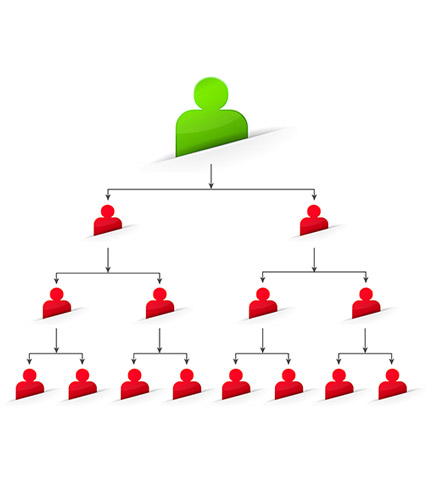
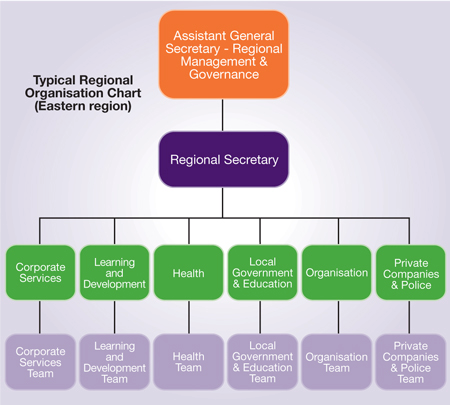

**This file started as a copy of the German translation of module 9 (["Wie wählt man das richtige Format für Open Data"](https://www.europeandataportal.eu/elearning/de/module9)) of the eLearning course on Open Data published by the [European Commission](https://ec.europa.eu/commission/index_en).**

**The original version has been tagged: [module-09-german-initial](https://github.com/knudmoeller/edp-open-data-course/blob/module-09-german-initial/course/german/09-formats/index.md).**

**To see the changes made, use the [compare function](https://github.com/knudmoeller/edp-open-data-course/compare/module-09-german-initial...master#diff-2f6bad7a03db5794a5b2fcfd73826fe7).**

# Wie wählt man das richtige Format für Open Data?

Das Format eines offenen Datensatzes bezieht sich auf die Art und Weise, wie die Daten strukturiert und für Mensch und Maschine verfügbar gemacht werden.

Das richtige Format wählen stellt sicher, dass Daten einfach verwaltet und wiederverwendet werden können.
Um die Wiederverwendbarkeit von Daten zu maximieren und den Bedürfnissen der Nutzer gerecht zu werden, kann es für einen Datenherausgeber erforderlich sein, diejenigen Formate und Strukturen zu verwenden, die als meistverbreitete gelten.

**In diesem Modul werden wir folgende Aspekte untersuchen:**

- Warum sind Datenformate wichtig?
- Wie kann man die richtige Datenstruktur für Open Data wählen?
- Wie wählt man das richtige Format für Open Data?
- Warum soll man mit dem CSV-Format arbeiten?

## Open Data Formate

ODI-Trainer David Tarrant erklärt, warum Formate bei der Veröffentlichung von Daten wichtig sind, wie man die richtige Struktur und richtige Formate wählt und warum das CSV-Format ein guter Ausgangspunkt für die meisten tabellarischen Daten ist.

## Verwendbarkeit, Verwaltung und Zugriff
 
Offene Daten müssen von jedermann ohne Einschränkung genutzt, weiterverbreitet und weiterverwendet werden dürfen.
In diesem Abschnitt betrachten wir, welche Formate die Verwendbarkeit der Daten, den einfachen Zugang für die Benutzer und die einfache Verwaltung durch den Datenherausgeber maximieren.
  
### Verwendbarkeit

Das beste Format für Daten ist wahrscheinlich das Format, in dem der Datensatz erstellt wurde.
In vielen Fällen kann dieses Fomat nur mit einem proprietären Softwareprogramm wie Microsoft Excel gelesen werden.
Während solche Programme oft die Möglichkeit bieten, Daten in andere Formate zu exportieren, kann eine geringe Verbreitung solcher Softwareprogramme die Wiederverwendbarkeit der Daten durch andere hindern.

Softwareprogramme wie Excel enthalten auch umfangreichere Funktionen, z.&nbsp;B. das Formatieren von Tabellen und Grafiken.
Diese können dem Nutzer helfen, die Daten einfacher zu verstehen.

### Management

Für einige Datenherausgeber, selbst für Mitarbeiter der Herausgeber-Organisationen, sind offene Daten zum Hauptteil ihrer eigenen Prozesse geworden.
Mitarbeiter können offene Daten nutzen, um auf Informationen innerhalb ihrer Organisation zuzugreifen. 
Die Nutzung von offenen Daten auf diese Weise bietet viele Vorteile:

- Das Wissen über Open Data innerhalb des Teams wird erhöht.
- Die Nachhaltigkeit und das Vertrauen in die Daten werden erhöht, indem offene Daten zu Schlüsselelementen innerhalb der Organisation werden.
- Es werden klare Möglichkeiten für Innovationen geschaffen.

### Zugriff

Damit offene Daten so zugänglich wie möglich sind, sollten diese in einem Format veröffentlicht sein:

- Das von Benutzern verstanden werden kann.
- Das von Maschinen gelesen werden kann.
- Das die einfache Wiederverwendung der Daten unterstützt.
- Das keine teuren Werkzeuge voraussetzt.

Das für jeden Datensatz geeignete Format kann unterschiedlich sein.
Ein Dokument (wie z.&nbsp;B. eine PDF-Datei) kann die Daten für einen Menschen leicht verständlich machen, aber es erschwert das Lesen durch einen Computer.
Aus diesem Grund wird die Zugänglichkeit oft dadurch erreicht, dass die Daten in unterschiedlichen Formaten bereitgestellt werden.

## Weitverbreitete Datenstrukturen

Nicht alle Daten lassen sich in einer tabellarischen Struktur darstellen.
Unterschiedliche Datenstrukturen müssen ggfs. berücksichtigt werden.
Es gibt drei wichtige Strukturen für Daten: Tabellen, Baum- und Netzstrukturen.

### Tabellen

Tabellen sind die häufigste Struktur für Daten. Tabellendaten sind in Zeilen und Spalten organisiert, in denen sequenzielle Werte (wie z.&nbsp;B. Ausgaben) aufgelistet sind.

Wenn die Daten auf getrennten Einträgen basieren, die nicht miteinander verknüpft sind, sind Tabellendaten in einem Format wie CSV zu empfehlen.
Ein Beispiel für solche Daten sind die Daten über die Anzahl der Museumsbesucher, die auf dem italienischen Open Data Portal veröffentlicht sind.

[Hier geht’s zum italienischen Open Data Portal](http://www.datiopen.it/opendata/Visitatori_musei_pubblici_e_similari_titolo_d_accesso)

### Baumstrukturen

Daten, die als Baumstruktur dargestellt sind, zeigen die Beziehungen zwischen Datenpunkten, wie z.&nbsp;B. einen Familienstammbaum oder die Gemeinden in jedem Land.
Wenn der Datensatz von der Beziehung zwischen Datenpunkten abhängt und einer Struktur folgt, in der Datenpunkte in vertikalen Bäumen verknüpft sind, ist eine Abbildung als hierarchische Baumstruktur in einem Format wie JSON ideal.
Ein Beispiel dafür ist diese JSON-Datei auf json.org.

[Hier geht’s zum Beispiel auf json.org](http://json.org/example.html)

### Netzwerkstrukturen

Daten, die als Netzwerk strukturiert sind, ermöglichen die Abbildung von Beziehungen zwischen beliebigen Kombinationen von Elementen in beliebiger Richtung.

Ein Beispiel für eine Netzwerkstruktur ist ein soziales Netzwerk. 
Denken Sie an Ihr Netzwerk von Freunden und deren Freunden auf Facebook.
Oder denken Sie an Ihre Kontakte (ersten, zweiten oder dritten Grades) auf LinkedIn.

Das Web ist ein weiteres Beispiel für eine Netzwerkstruktur, in der Webseiten mit einer beliebigen Anzahl anderer Seiten in beliebiger Richtung verknüpft sind.

## Offene Daten in den richtigen Formaten finden

Als Nutzer von offenen Daten ist es wichtig zu verstehen, wie Datenherausgeber Ihnen Daten in verschiedenen Formaten bereitstellen.

Nicht alle Daten sind zum Herunterladen geeignet, weil sie entweder zu groß, zu regelmäßig aktualisiert oder zu komplex sind, um sie als statische Dateien zu veröffentlichen.
Einige Daten müssen möglicherweise in kleinere Dateien aufgeteilt werden.
Andere Daten müssen möglicherweise als Live-Feeds veröffentlicht werden, um sicherzustellen, dass sie auf dem neuesten Stand sind.

Klicken Sie auf die jeweiligen Überschriften, um mehr zu erfahren

### Offene Daten, die heruntergeladen werden können

Tabellarische Daten eignen sich am besten zum Herunterladen.
Aus diesem Grund bestehen die meisten offenen Datenportale von Regierungen überwiegend aus tabellarischen Daten.
Weitere Aspekte sollten bei der Verwaltung von Millionen von Datenzeilen in Betracht gezogen werden:

- Sollten die Daten in kleinere Datensätze aufgeteilt werden?
- Wie oft sollten die Daten aktualisiert werden?
- Wie wirken sich Änderungen hinsichtlich der Art der Veröffentlichung auf die vorherigen Datensatzversionen aus?

### Live-Daten und Datenfeeds

Einige Daten sind nicht dazu geeignet, als herunterladbare Dateien bereitgestellt zu werden.

Viele dieser Daten werden so oft aktualisiert, dass der Download der jeweiligen Daten für die meisten Nutzer zu häufig durchgeführt werden müsste.
Diese Art von Datenstrukturen können durch eine Maschinenschnittstelle zur Verfügung gestellt werden, die auch als _application programming interface_ (API, deutsch "Anwendungsprogrammierschnittstelle") bekannt ist.

Es gibt viele Dienste, die Maschinenschnittstellen im Internet zur Verfügung stellen.
Diese Dienste können direkt in andere Webanwendungen integriert werden.
Ein Beispiel für eine offene Daten-API finden Sie bei der belgischen Eisenbahngesellschaft.

[Hier geht’s zum iRail API](https://hello.irail.be/api/1-0/)

## Das richtige Format für Open Data wählen

Wenn es um Open Data Formate geht, sollten Sie am besten mit CSV anfangen.

Eine CSV-Datei (_Comma Separated Values_) besteht aus einfachen Datenzeilen, wobei jeder Datenpunkt durch ein Komma vom nächsten getrennt ist.
CSV ist perfekt für Tabellendaten geeignet und kann in Anwendungen wie Excel geladen und gespeichert werden.

CSV bietet zwar keine Formatierungen und Diagramme wie Excel-Formate, ist aber ein offenes, maschinenlesbares Format.
Dies macht die Daten für den Benutzer einfach zugänglich.
CSV stellt das einfachste Format dar, das weiterhin eine breite Wiederverwendung von Open Data unterstützt.
Mit anderen Worten, CSV ist 'der kleinste gemeinsame Nenner' für Open Data.
Open Data sollte, wann immer möglich, in diesem Format zur Verfügung gestellt werden.

## Das richtige Format für Geodaten

Geodaten sind oft komplexer als einfache tabellarische Daten.

Geodaten können als Baumstruktur, z.&nbsp;B. mit Details zu Ländern und Regionen, oder als Netzstruktur, z.&nbsp;B. mit Details zu Straßen, abgebildet werden.

Bei der Veröffentlichung von Geodaten sollten Formate wie [geoJSON](https://en.wikipedia.org/wiki/GeoJSON) (basierend auf JavaScript Object Notation - JSON) und [KML](https://en.wikipedia.org/wiki/Keyhole_Markup_Language) (basierend auf Extensible Markup Language - XML) berücksichtigt werden.

Diese Formate sind speziell auf die Verwendbarkeit ausgelegt und können problemlos mit speziellen Mapping-Tools wie [Open Street Map](http://www.openstreetmap.org/) und [CartoDB](https://cartodb.com/) importiert und exportiert werden.

## Nutzen Sie die richtigen Formate?

Testen Sie Ihr Wissen über Open Data Formate mit unseren Fragen.
Können Sie sich an die wichtigen Punkte erinnern?

### Wie wählt man das richtige Format für Open Data

Das richtige Format ist wichtig, denn es hilft:

**Wählen Sie Ihre Antwort und klicken Sie dann auf "Absenden"**

- Kosten zu senken
- sicherzustellen, dass die Privatsphäre geschützt ist
- die Verwendbarkeit, Nutzlichkeit, Pflege und den Zugriff sicherzustellen

### Welche Datenstruktur würden Sie für die Daten hier im Bild nutzen?

Welche Datenstruktur würden Sie für die Daten hier im Bild nutzen?

**Wählen Sie Ihre Antwort und klicken Sie dann auf "Absenden"**

- Tabellen
- Baumstrukturen
- Netzwerkstrukturen

### In welchem Format sollen idealerweise offene Daten bereitgestellt werden?

In welchem Format sollen idealerweise offene Daten bereitgestellt werden?

**Wählen Sie Ihre Antwort und klicken Sie dann auf "Absenden"**

- DOC
- PDF
- CSV

## Open Data Formate

Das Format eines Datensatzes bezieht sich auf die Art und Weise, in der der Datensatz strukturiert und für Menschen und Maschinen bereitgestellt ist.

Das richtige Format zu wählen stellt sicher, dass Daten einfach verwaltet und wiederverwendet werden können.
Um die Wiederverwendbarkeit von Daten zu maximieren und den Bedürfnissen der Nutzer gerecht zu werden, kann es für einen Datenherausgeber erforderlich sind, diejenigen Formaten und Strukturen zu verwenden, die als meistverbreitete gelten.

CSV sollte als die erste Option gewählt werden, um Daten bereitzustellen.
CSV stellt das einfachste Format dar, das weiterhin eine breite Wiederverwendung von Open Data unterstützt.

[Nächstes Modul](../10-usability/index.md) 
[Hauptmenü](../index.md)

The content of this page, including all text, images and markup, is licensed under the [Creative Commons Attribution-ShareAlike 4.0 International License](https://creativecommons.org/licenses/by-sa/4.0/).

The content is based on the German translation of module 9 (["Wie wählt man das richtige Format für Open Data"](https://www.europeandataportal.eu/elearning/de/module9)) of the eLearning course on Open Data published by the [European Commission](https://ec.europa.eu/commission/index_en), and equally licensed under a [Creative Commons Attribution-ShareAlike 4.0 International License](https://creativecommons.org/licenses/by-sa/4.0/).

Date copied was 2019-02-04.

